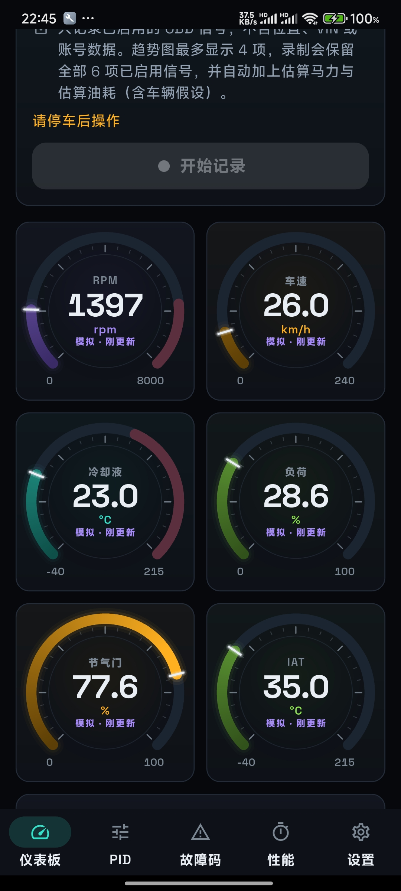
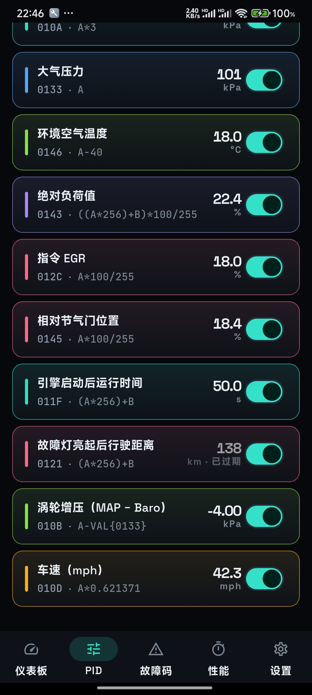
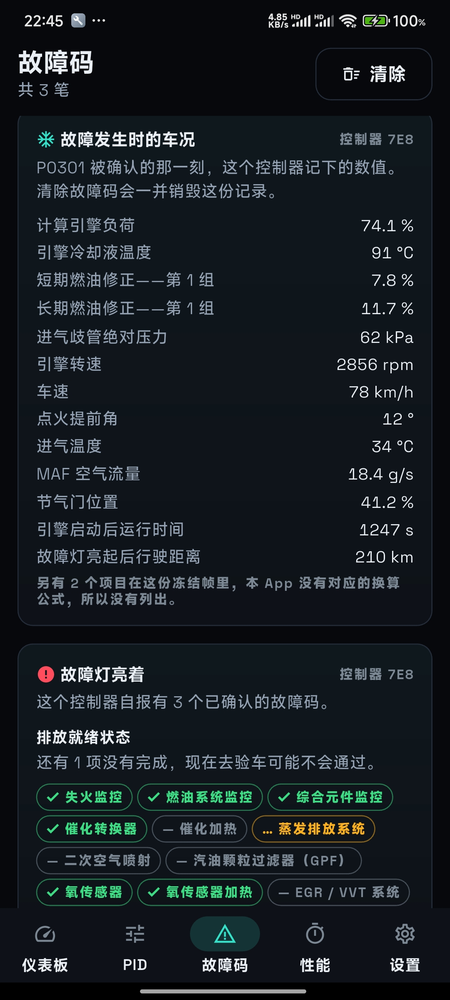
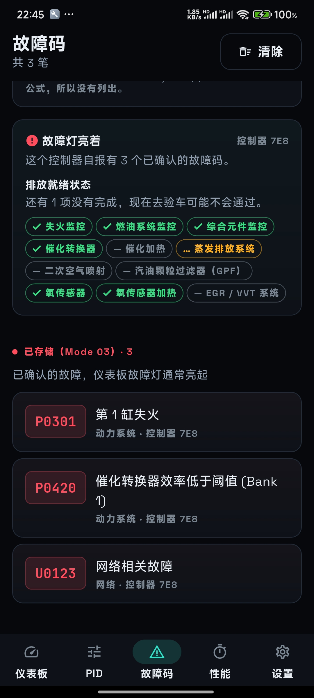

[English](README.md) | **简体中文** | [繁體中文](README.zh-TW.md)

# Telltale

> **本仓库是 Telltale 的 fork，新增简体中文界面。** 与上游一样采用 GPL-3.0，
> 不提供任何担保。[English](README.md)。
>
> **本 fork 仓库：** https://github.com/chaoduo/telltale-OBD- ——
> 简体中文版相关的问题与 PR 请提到这里。改动清单见
> [本 fork 的改动](#本-fork-的改动)；除此之外都是上游代码，未做改动。
>
> **上游：** https://github.com/aa22396584/telltale —— 原始 App（英文、繁体中文、
> 德文）。另有 [GitLab](https://gitlab.com/aa22396584/telltale) ·
> [Codeberg](https://codeberg.org/ImL1s/telltale)。旧账号 `ImL1s` 目前受限，
> 请改用 `aa22396584` 浏览与贡献。下面的徽章与发布链接都属于上游，不是本 fork。

> **安装本 fork：** 自行编译（见[构建与测试](#构建与测试)），或从本仓库的 Releases
> 取 APK。它没有上 Google Play，也不能与上游 App 同时安装：包名相同、签名不同。

> **上游安装／停机指引：** 建议优先
> **[Google Play](https://play.google.com/store/apps/details?id=com.cbstudio.telltale)**；
> 社区 APK **[Codeberg v1.0.14](https://codeberg.org/ImL1s/telltale/releases/tag/v1.0.14)**、
> **[GitLab Releases](https://gitlab.com/aa22396584/telltale/-/releases)**，或
> **[GitHub Releases（aa22396584）](https://github.com/aa22396584/telltale/releases)**；
> [Obtainium](https://github.com/ImranR98/Obtainium) 请指向
> `https://codeberg.org/ImL1s/telltale/releases` 或
> `https://github.com/aa22396584/telltale/releases`。

[](https://github.com/aa22396584/telltale/actions/workflows/ci.yml)
[](https://github.com/aa22396584/telltale/releases)
[](https://play.google.com/store/apps/details?id=com.cbstudio.telltale)
[](LICENSE)

Telltale 是开源 Flutter App，通过 ELM327 兼容适配器提供实时车辆遥测与
OBD2 故障诊断。它的设计原则是诚实呈现不确定性，不把格式错误、不完整或互相冲突
的响应包装成看似可信的结果。

> **一个看起来合理的错数字，比没有数字更糟。**

> **没车、没适配器？用 Demo ECU。**
>
> 在连接画面点 **Demo 模拟器** → **启动模拟器**，就能看仪表板、故障码与冻结帧，不需任何硬件。Demo 不走蓝牙、不走真实 socket、也不接车辆——它只证明 App 本身能跑，不代表真车上一定能连得上。

## App 截图与实车示范

下面这几张是本 fork 自己的简体中文截图（真机、Demo ECU）：

<p align="center">
  
  
  
</p>

<p align="center">
  
</p>

[](https://youtu.be/Ugyg4RXhjVQ)

> 上面那张横幅与下面链接的视频仍是上游素材（`store/zh-TW/`）。[文档](#文档)一节
> 指向的实车指南与协议差异说明目前也只有繁体中文版（`docs/*.zh-TW.md`），尚未翻译。

**[在 YouTube 观看 Toyota GT86 与 BLE ELM327 实车示范](https://youtu.be/Ugyg4RXhjVQ)。**
视频记录一组 Samsung 手机、适配器与车辆的实际连接，实车 VIN 已遮蔽；这是该组合
的实测证据，不代表所有手机、适配器或车辆都兼容。

## 下载与安装

**本 fork 没有上 Google Play。** 请自行编译（见[构建与测试](#构建与测试)），或取本仓库
Releases 里附的 APK。下面这一段讲的是**上游**的构建。

**建议优先：** **[前往 Google Play 获取 Play 签名版](https://play.google.com/store/apps/details?id=com.cbstudio.telltale)。**

**Google Play 版付费，但 App 功能相同。** Play 版不会解锁额外的遥测或诊断功能；
它提供由 Google Play 直接安装与更新的便利，购买也会支持持续开发与维护。
下方的社区签名 APK 与自行从源代码构建仍可免费使用。

**社区签名 APK**（功能与 Play 版相同；源代码目录不含 release 产物）：

1. **[GitHub aa22396584 v1.0.14](https://github.com/aa22396584/telltale/releases/tag/v1.0.14)**
2. **[Codeberg v1.0.14](https://codeberg.org/ImL1s/telltale/releases/tag/v1.0.14)**
3. **[GitLab Releases](https://gitlab.com/aa22396584/telltale/-/releases)**

打开该版本，选择其中的 `.apk` 文件。[Obtainium](https://github.com/ImranR98/Obtainium)
可从 `https://github.com/aa22396584/telltale/releases` 或
`https://codeberg.org/ImL1s/telltale/releases` 追踪更新。

社区构建使用与 Google Play **不同的签名密钥**，无法更新 Play 版，也无法由
Play 版直接更新。两者互换时必须先卸载；卸载会删除 App 本机数据，
请先导出需要保留的内容。

## 支持功能

- Bluetooth Classic（RFCOMM/SPP）
- Bluetooth LE（GATT UART service）
- Wi-Fi 适配器的局域 TCP 连接
- 不需适配器或车辆的内置 Demo ECU
- 实时 PID 仪表、故障码、冻结帧、排放就绪、自定义 PID，以及由用户主动导出
  的诊断记录
- 可搜索且经完整性检查的 schema v3 大电池目录，收录 221 条有来源的 PHEV、
  HEV、BEV、MHEV、REEV 与 FCEV 车型配置：205 条是只有 metadata、完全没有
  指令的 `researchOnly`；十二条是**可安装**的跨来源佐证 `community` 条目
  （MG ZS EV Mk1、MG4 Electric、MG5 EV、BYD Atto 3、Hyundai Ioniq 5／Ioniq 6、
  Kia EV6、Hyundai Kona Electric、Kia Niro EV、Kia Soul EV、Renault Zoe Ph1、
  VW e-up! gen2——只读 BMS 仪表，每条公式都经至少两个独立实现逐 byte 比对，
  安装时需确认车辆身份，且每次连接都要重新确认车辆才会开始读取）；四条
  `experimental`（Lexus RX450hL、Toyota Prius TNGA、Kia EV9、Toyota bZ4X／
  Subaru Solterra e-TNGA）。其中三条 Mode 22（Prius、EV9、e-TNGA）可安装，
  并标成实验 · 本车未验证；Lexus 的 Mode 21 对照只能走单次实验室。
  可执行子集合计 157 个有边界的只读信号；动力分布为 BEV 89、FCEV 5、
  HEV 48、MHEV 7、PHEV 69、REEV 3
- 内置经完整性检查、完全离线的美国 EPA Find-a-Car 快照：50,242 条精确配置、
  146 个 make／品牌（制造商部门）标签、年款 1984–2027。只套用语义能与公式配置逐栏对上的官方数据，
  不推测车重、扭矩、风阻、VE 或传动效率
- 每组车辆配置都套用安全确认流程：未确认车重、VE、风阻与驱动方式前，
  车辆有回复的 OBD 实测值仍可显示，但不会用通用预设值冒充实车的马力、扭矩或油耗；
  每次重新连接都会自动失效，避免把上一辆车的配置套到下一辆

大电池证据实验室默认关闭。Settings 的持久开关只会显示实验入口，不代表信任
任何车辆。每次连接、每条指令、每次尝试都必须重新选一条目录内固定的 Mode 21
或 22 指令，并短效确认所选年款、已知身份证据、未证实字段与车辆已安全停妥。
App 只送一次：不扫描 identifier、不批量、不自动重试、不安装、不调度轮询、不把
解码值持久化，也不放入 dashboard。回复必须逐项通过固定 responder、positive
response echo、exact payload length、有限公式结果与数值范围检查。

一次性同意会绑定已验证的目录哈希、来源 revision、profile、指令、年款与连接
世代，两分钟后失效；另有五秒 cooldown、每条指令每次连接最多三次、single-flight、
结构错误隔离，以及后台／连接边界失效。一般诊断记录仍会保存该次指令与回复作为
证据；合成台架或手机 transport 测试不等于实车 PID 或解码正确性证明。完整数量、
来源限制、同意规则、许可与验证边界见
[大电池车型配置说明](docs/powertrain-battery-profiles.md)。

Android 是设备、UI 与 BLE rig 路径的主要实体测试平台。iOS、macOS、Windows
与 Linux 有公开编译闸门与可执行的 Demo／Wi-Fi 路径；BLE 在每个出货主机都已
接上（Linux 走 BlueZ／D-Bus）。它们尚无同等的实体适配器或实车证据。
Bluetooth Classic 在 UI 上对 Android、macOS、Windows、Linux 开放
（`classicTransportAvailable`）：Android 为已实机验证的 RFCOMM/SPP；macOS 走
IOBluetooth RFCOMM；Windows／Linux 分别走蓝牙 SPP COM 与 `/dev/rfcomm*`。
iOS 永久不开放第三方 SPP，Classic 卡片维持灰色。桌面 Classic 已接线，但在
有通电适配器实机证据前仍不称为成熟。见
[平台支持说明](docs/platform-support.md)。

## 已实车连接的适配器

维护者已用 **CARLZS LAB CL-OBDII-M25B**（`OBDBLE`、NCC
`CCAH22LP5300T8`）通过 Bluetooth LE 让 Telltale 连接 Toyota GT86。同一支
Samsung `SM-S9280` 目前仍保留一份日期为 2026-08-27、大小 418,028 bytes 的
Telltale 恢复会话记录。

**[在虾皮查看这支适配器](https://s.shopee.tw/3LQPiOY7uv)** —— 这是维护者的推广
分润链接；符合条件的购买可能让维护者取得佣金，你也可以自行搜索或向其他渠道购买
同型号。App 里也有同一笔：设置页是完整披露卡，连接页只在适配器列表下方放次要
文字链接。

这只代表一组适配器、手机与车辆的实际观察，不是认证，也不保证同一卖场的所有
版本、所有手机、车辆、PID 或固件行为相同。购买前请核对完整型号与 NCC 号码；
证据边界见[硬件兼容性说明](docs/hardware-compatibility.md)。

## 构建与测试

使用固定的 Flutter 3.47.0 工具链：

```bash
git clone https://github.com/aa22396584/telltale.git
cd telltale
FLUTTER="$HOME/fvm/versions/3.47.0/bin/flutter"
"$FLUTTER" pub get
"$FLUTTER" analyze
"$FLUTTER" test
"$FLUTTER" build apk --debug --flavor field
```

若要构建自行签名的 release，请依照
[维护者 release 指南](docs/maintainers/release.md)。`field` flavor 才是实际使用的
App；隔离的 `rig` flavor 是测试基础设施。

## 验证边界

Samsung 实体手机到 Mac 的 BLE GATT 无线路径，已搭配模拟 ELM327 peripheral 通过。
这证明该路径上的实体 BLE 扫描、GATT 连接、UART 写入与通知。上面的实车观察则
另外证明一组购入的 CL-OBDII-M25B 曾让 Telltale 连上 Toyota GT86，并留下足量的
会话记录。原始实车记录可能含 VIN 与设备识别信息，因此未公开，只在本机做过
脱敏分析。分析确认该次会话使用 CAN 11-bit/500 kbit/s，且保留的空闲轮询
没有 `NO DATA`、CAN/BUS error、超时或格式错误；但中段记录因容量上限大量舍弃，
所以这项观察**不代表**已认证适配器固件、PID 准确度、DTC 覆盖率、道路负载行为
或所有 GT86。

验证文档只描述有边界的证据，不是认证或安全保证。请先阅读
[测试证据](docs/verification/test-evidence.md)、
[设备验证](docs/verification/device-verification.md)，以及逐层列出可重现与商用测试设备的
[验证台架矩阵](docs/verification/rig-matrix.md)。

## 项目目录

| 路径 | 用途 |
| --- | --- |
| `lib/` | App、状态、UI、ELM327 协议与 transports |
| `test/` | 单元、契约、parser 与 widget 测试 |
| `integration_test/` | 设备与隔离 rig 流程 |
| `tool/` | 可重现的模拟器与验证工具 |
| `android/`、`ios/`、`macos/` | 平台集成 |
| `assets/` | 内附字体、图标与官方车辆数据快照 |

## 文档

| 文档 | 用途 |
| --- | --- |
| [文档索引](docs/README.md) | 所有使用、证据与维护者文档 |
| [实车指南](docs/field-guide.zh-TW.md) | 安全的实车流程与故障排除 |
| [协议差异](docs/protocol-deviations.zh-TW.md) | 标准查证与硬件行为注释 |
| [车辆数据来源](docs/vehicle-data-sources.md) | 官方快照、字段语义、哈希与市场边界 |
| [大电池车型配置](docs/powertrain-battery-profiles.md) | 目录数量、安装闸门、证据、来源与实车限制 |
| [版本记录](CHANGELOG.md) | 各版本可见变更 |
| [贡献指南](CONTRIBUTING.md) | 开发与 pull request 要求 |

## 隐私与安全使用

Telltale 不会主动上传数据。本机诊断导出可能含 VIN、设备、适配器与故障识别信息；
导出与分享由你主动控制，操作系统备份也可能依设备设置复制 App 私有数据。请阅读
[项目内政策](PRIVACY.md)或
[已发布的隐私政策](https://aa22396584.github.io/telltale/privacy.html#zh)。

请只在停稳时操作，或交由乘客操作。清除 DTC 前先保存诊断证据，也不要以本 App
取代专业检查。安全漏洞请依 [SECURITY.md](SECURITY.md) 私下回报；社区互动规范见
[CODE_OF_CONDUCT.md](CODE_OF_CONDUCT.md)。

## 支持

如果这个项目帮你省下了时间，可以[请作者喝杯咖啡](https://buymeacoffee.com/iml1s)。

## 本 fork 的改动

上游的 App，加了一套简体中文界面。除此之外不打算有任何差别，改动小到可以一次看完：

| 文件 | 改动 |
|---|---|
| `lib/l10n/app_zh_Hans.arb` | 新语系：1220 条文案，自 `app_en.arb` 翻译 |
| `lib/l10n/pid_labels.dart` | 新增：把内置 PID 映射到它随包发布的名称 |
| `lib/obd/pid/pid.dart`、`pid_library.dart` | 新增 `Pid.l10nId`，25 个内置 PID 都标上；自定义与车型目录的 PID 仍原样显示作者写的 `name`/`shortName` |
| `lib/ui/screens/pids/pid_manager_screen.dart`、`dashboard_screen.dart`、`dtc_screen.dart`、`lib/ui/wear/wear_shell.dart`、`lib/ui/widgets/telemetry/telemetry_lane_selector.dart` | 改画随包发布的 PID 名称，而不是作者写的英文名 |
| `lib/l10n/locale_resolution.dart`、`app_locales_sync.dart`、`lib/ui/widgets/language_picker.dart` | 提供「简体中文」选项；`zh-Hans`、`zh-CN`、`zh-SG` 与跟随系统都映射到它 |
| `android/app/src/main/kotlin/.../AppLocalePolicy.kt`、`android/app/src/main/res/xml/locales_config.xml`、`ios/Runner/Info.plist`、`macos/Runner/Info.plist` | 向系统注册 `zh-Hans`；没有这一步，Android 13+ 会把 App 内切到简中当成未知标签直接拒绝 |
| `tool/i18n/apply_translation.py`、`tool/build_apk.sh` | CSV → ARB 导入（跑本仓库自己的校验），以及一个设好 `allowUnsignedRelease` 的 release 构建脚本 |

本 fork 没碰过的文件都是上游的，钉住上游文案的测试也仍然钉着它。`test/l10n/`
除上游的 `glossary_evidence_test` 外全部通过——那个测试对本快照里 `README.md` 与
`app_en.arb` 的行号引用本来就已经失效。

## 许可与声明

欢迎依[贡献指南](CONTRIBUTING.md)参与。Telltale 采用
[GPL-3.0](LICENSE) 许可，本 fork 同样是 GPL-3.0：改动的文件就是上面列出的那些，
许可证与上游版权声明均未改动。与 Ian Hawkins 的 Torque / Torque Pro 无关，也不是其
官方或衍生版本。随 App 提供的官方车辆数据快照另有
[来源与重用声明](assets/vehicle_catalog/NOTICE.md)，大电池数据另有
[第三方来源声明](THIRD_PARTY_NOTICES_POWERTRAIN_BATTERY.md)。请自行承担使用风险；
任何诊断结果都不保证车辆可安全行驶。
